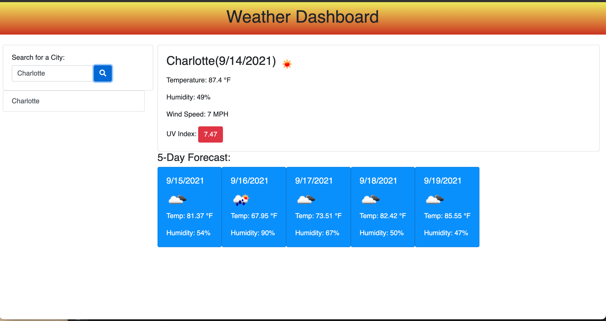

# Weather Dashboard
### User can view the current weather conditions for any city they search. User will be presented with the temperature, the wind speed, humidity, and the UV index. The UV index will indicates if the conditions are favorable, moderate, or severe. 
 

### Dashboard will keep a record of all cities the user has searched. User will be able to view cities previously searched and get a current display of the weather conditions. All searches ,as well as coordinats, also be saved to the local storage.

 
 

## Link to Deployed Page
[Click Me!](https://brittnc.github.io/WeatherDashboard/)

 

## Screenshots Of Deployed Page

